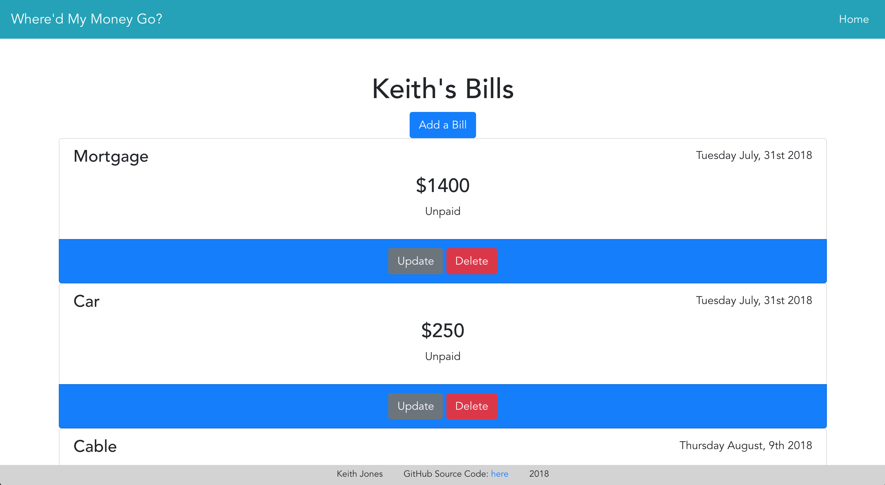

# Where'd my Money Go?

An app for consolidating all your bills in one place, organizing them by due dates and allow you to check them off when they're paid.

---

## Deployed Link:

[Where'd my Money Go?](https://whered-my-money-go.firebaseapp.com/#/)



---

### Limited Use

App is only a prototype with 3 demo usernames:
- Keith
- Kaitlin
- Brandon

---

## Tech/Framework Used

<b>Built with:</b>
- [Vue.js](https://vuejs.org/)
- [Bootstrap + Vue](https://bootstrap-vue.js.org/)
- [Express/Node.js](http://expressjs.com/)
- [Knex.js](https://knexjs.org/)
- [PostgresSQL](https://www.postgresql.org/)

---

## Future Implementations

- Build fully authenticated login with the ability to create and edit users.
- Have 'paid' functionality automatically bump due-date to next month's due date

---

## Client Setup

``` bash
fork and clone this repo

# install dependencies
npm install

# serve with hot reload at localhost:8080
npm run dev

```

---

## Database API

[Here](https://github.com/joneskc/whered-my-money-go-be)

---

## License

MIT © Keith Jones


